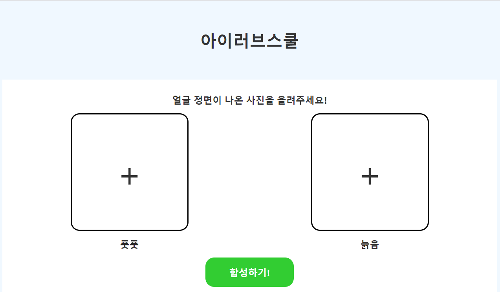
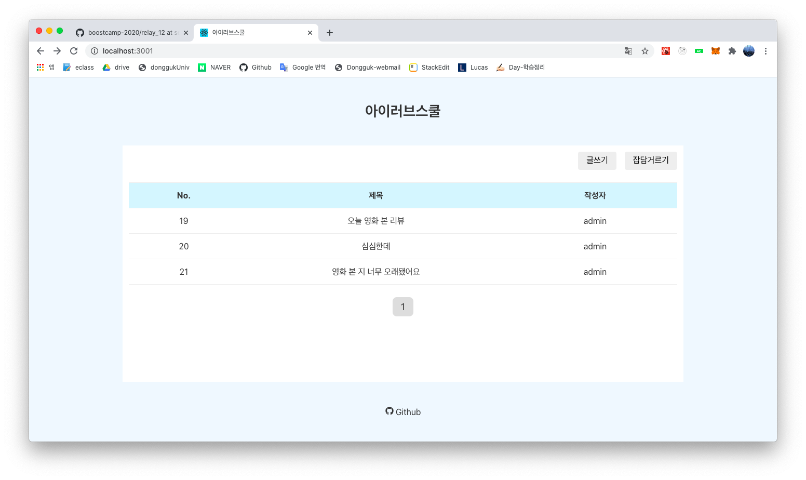

# Relay_12

## 아이러브스쿨

라떼에는 많이 사용했던 아이러브스쿨을 재해석합니다.

## Week3

### URL : https://relay12-front.run.goorm.io/image/upload

### 체크포인트

**프론트엔드**

- [ ] 사진 입력 페이지 생성
- [ ] 사용자가 사진 두 장을 입력
- [ ] 입력받은 사진을 Nodejs 서버에 전송
- [ ] 생성된 파일의 이름을 입력받아 이미지 렌더링 (구현 부족)

**백엔드**

- [ ] 프론트로부터 POST 요청으로 사진파일 두 장을 수신
- [ ] Python Shell을 통해 사진 합성 파이썬 파일을 실행
- [ ] Python FaceSwap 라이브러리를 사용하여 얼굴을 합성 (구현 부족)
- [ ] 합성된 사진을 프론트엔드 프로젝트 폴더 내에 전송 (구현 부족)
- [ ] 구름 컨테이너에 서버를 구축, 외부 접속 가능

### 회고 및 소감

- J016 권영길 : 매주 바뀌는 주제와 개발환경을 맞추는 게 생각보다 더 어려웠습니다. 하지만 remote vscode도 써보고 goorm도 써보고 다양한 경험을 하고 있습니다. 다양한 지식을 가진 팀원이 모여 같이 프로젝트를 수헹하는 값진 경험을 할 수 있어 좋았습니다.
- J038 김부건 : 웹 개발이 전무하다 보니 프로젝트 진행에 많은 무력감을 느끼고 도움이 1도 되지 못해 죄송했습니다 ㅠ 잘하시는 분들을 보면서 많은 동기부여를 받았고, live share라는 좋은 도구를 알게 되서 유익했습니다 ㅋㅋㅋ 기획과 첫 스타트를 다른 팀들이 끊은 뒤 이어 받은 터라 흐름 파악하는 데에 많은 어려움이 있었고, 자연어 처리에 비해 이미지 관련 api는 제공되는 폭이 적다는 사실을 알 수 있었습니다. 릴레이 프로젝트간 고생하신 분들께 깊은 감사를 표하며 모두 성공적인 가도를 달리시길 응원합니다 :hugging_face:
- J090 박진영 : 짧은 시간 안에 온라인 환경속에서 협업을 해야해서 VsCode LiveShare 기능과 ZOOM을 이용했는데 실시간으로 함께 디버깅하고 결과를 확인하는 색다른 경험을 할 수 있었습니다. 완벽히 구현하지 못한 점이 아쉽긴 하지만 짧게나마 AI를 활용하는 법에 대해 알게 되고 react 페이지 구현, node에서 python 실행 등 새로운 것들을 배울 수 있어 좋았습니다!
- J102 신동훈 : 11명의 팀원과 함께 매주 새로운 프로젝트를 구현한다는 것이 정말 신선했고, 좋은 경험이 되었습니다. 욕심만큼 완벽하게 구현하진 못한것 같아 아쉽긴 하지만 한 단계 성장할 수 있는 기회였습니다. !
- J106 신지연 : 능력이 많이 부족하여 큰 도움이 되지 못한 것 같습니다ㅠㅠ그래도 좋은 팀원분들 만나서 많이 배울 수 있었습니다! 리액트,,,,앞으로 열심히 공부해보겠습니다....ㅠㅠ 아 처음 사용해보는 vscode의 라이브 쉐어 기능도 정말 신기했습니다!
- J130 윤준성 : 이번 릴레이 프로젝트를 통해서 서비스하나를 구축하는 것에도 많은 일이 생긴다는 것을 깨달았습니다. 또한 아직 제가 공부할 점도 많이 남아있고, 코딩 실력외에도 프로그램을 구축하는 법, 좀더 사용자가 사용하기 편하게 만드는 법 등 공부해야 할 부분도 많이 보였습니다. 이번주에도 많은 것을 배워가는 릴레이 프로젝트였습니다.
- J142 이석재 : 서비스를 개발하기도 어렵지만, 실제로 배포하고 운영하는 것 또한 쉬운 일이 아니라는 것을 알게 되었습니다. 또 개발 중에 발생하는 다양한 에러를 해결하기 위해선 넓고 깊은 도메인 지식 습득이 필요하고 느꼈습니다. 이번 주도 많이 배웠습니다. 감사합니다.
- J154 이은솔 : 릴레이 첫 주는 시작부터 버벅거렸던 것 같은데, 이제 협업하는 방법이 무엇인지 어렴풋이 터득한 것 같습니다. 그리고 서로에게 도움이 되고자 노력하고 응원하는 모습들에 감사했습니다!:grinning:
- J157 이주현 : 첫번째로 멤버가 바뀌었을때는 기획만 되어있는 상태라 처음부터 개발할 수 있어서 일을 나누는 작업이 어려웠는데 두번째로 바뀌었을 때는 일을 나누는 것보다 이전에 개발된 부분을 파악하고 이어서 하는 부분이 더 어려웠던 것 같습니다. 그래도 모두들 열심히 각자 맡은 부분에서 노력해주시니 개발이 진행되는 모습이 보여 신기했습니다. 다들 너무 고생 많으셨고 다음주에는 다같이 더 성장해서 더 좋은 결과 냈으면 좋겠습니다!
- J160 이지우 : 많은 사람들과 함께 개발해볼 수 있는 기회가 되어 좋았습니다. 잘 모르는 기술에 대해서도 공부하며, 요구사항을 구현하려고 노력하여 완벽하지는 않지만 직접 결과물을 만들어낸 것 이 뿌듯했습니다.
- J078 박솔민 : 기획부터 구현을 하는 프로젝트가 아니라 처음 보는 프로젝트를 저희가 이어받아 구현하는게 재밌었습니다. 동료들과 생각해보지도 않은 기술에 대해 고민하고, 공부하는 과정이 어려웠지만 결국 완벽하진 않지만 개발이 점차 진행되는 과정이 뿌듯했습니다. 구현하지 못한 부분이 있어 아쉬웠지만 과정이 즐거웠고 협업에 대해 조금은 알아갔던 계기가 됐습니다.

### 1. 인공지능 - 영상인식

예전 모습에 현재 얼굴을 합성하여 보여줍니다.

**DEV** Python3

**Tech** [FaceSwap](https://github.com/wuhuikai/FaceSwap)

### 2. Back-end

Front로부터 이미지를 받아 python 프로그램을 돌린후 합성이미지를 Front-end 프로젝트 내 폴더로 돌려주는 API를 구현했습니다.

Front에서 받아온 이미지는 multer 라이브러리를 활용해 upload폴더에 저장됩니다.

**DEV** Node.js

**TECH** multer

### 3. Front-end

- 풋풋과 늙음 부분에 각각 이미지를 업로드 후, 합성 하기를 클릭 시 NodeJs로 두 사진과 함께 post 요청을 보내게 됩니다.
- 합성된 이미지가 생성되면 위의 경로에 생성된 이미지를 받아와 렌더링하게 됩니다.

## Week2

### 1. 인공지능 - NLP

게시판 주제에 맞지 않는 글을 필터링하는 기능을 구현하였습니다.

**DEV** Python3, Java

**TECH** Word2vec

> 실행을 위한 Dependency 설치와 기타 관련 내용은 [/server/nlp/README.md](./server/nlp/README.md) 를 확인해주세요.

### 2. Back-end

`admin` 이라는 이름을 가진 user 한 명과 하나의 게시판이 존재한다는 가정하에 구현했습니다.

**DEV** Node.js, Mysql

> - 실행을 위한 Dependency 설치와 기타 관련 내용은 [/server/README.md](./server/README.md) 를 확인해주세요.
> - API 문서는 [Git Wiki](<(https://github.com/boostcamp-2020/relay_12/wiki)>)를 확인해주세요

### 3. Front-end

게시판 페이지, 게시글 상세 페이지, 게시글 등록/수정/삭제를 구현하였습니다.

**DEV** React

> 실행을 위한 Dependency 설치와 기타 관련 내용은 [/front/README.md](./front/README.md) 를 확인해주세요.

**게시판 페이지**

