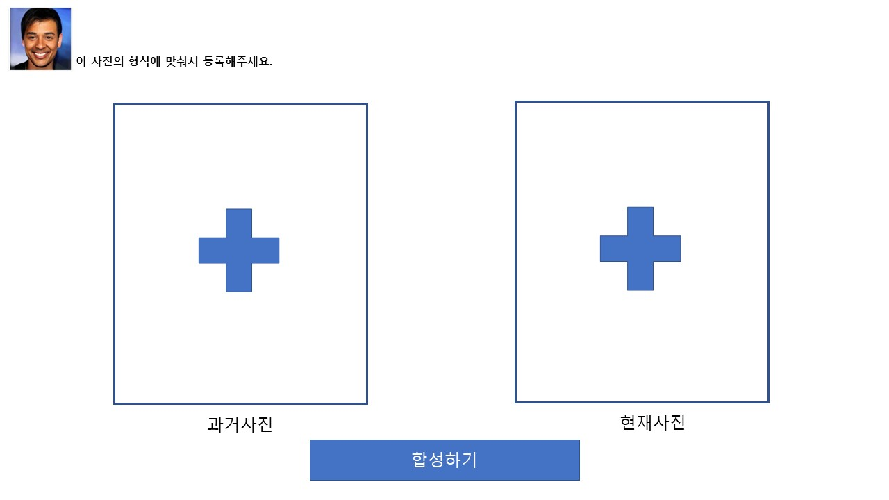

# week1_relay

#1 릴레이 프로젝트기획

## 📌결정된 기능

### A. 자연어 처리

- 게시글 필터링

### B. 이미지/영상

- 얼굴 합성

### C. 테이블 값 데이터

- 사용자/모임 추천

# 설계

### 사용 프레임워크

- 장고
    - 백엔드에서 파이썬을 사용하여 구현하기 쉬움
    - 프론트와 백을 동시에 개발 가능

### 데이터베이스 설계

User

- 이름
- 학교 이름 → ex) [{중학교, 졸업년도}, {고등학교, 졸업년도}, {대학교, 졸업년도}]
- 취미 / 관심사

Group

- 모임 이름
- 주제 (학교, 취미 ... )
- 태그

Post

- 제목
- 내용
- 작성 일시
- 학교
- 모임
- 태깅

### Tables

- User (U) 사용자

    UserID -PK | PW |  NAME  | Join-DATE | SchoolID S_FK 

- School (S) 학교

    ID - PK | NAME

- U-Hobby (UH) 사용자의 모임

    UserID - U_FK | HobbyID H_FK | SchoolId

- Hobby (H) 취미 관심사

    ID - PK | NAME

## A기능

- 주요기능
    - 유저가 많은 게시글 중 잡담 / 모임의 주제에 맞는 글 관련 글을 필터링 하여 편하게 볼 수 있도록
- 제한점
    - 회원가입
    - 게시글 작성
- 화면
    - 회원가입 화면

        ID / PW / 학교 선택 / 관심사 선택(다중) / 사용자 이름

    - 모임 선택 화면

        모임 리스트 (모임 가입 기능)

    - 게시글 목록 화면

        게시글 리스트 / 게시글 작성 버튼 / 게시글 보기 버튼 / 잡담 글 필터 체크박스

- 시나리오
    - 글 작성
        1. 사용자가 글을 작성
        2. 작성된 글을 인공지능 모델이 게시판 주제와 글의 주제의 유사도 분석
        3. 분석 결과에 의해 게시글을 잡담인지 아닌지 태깅
        4. 분류 결과와 함께 DB에 저장
    - 글 조회
        1. 사용자가 글을 조회
        2. 잡담 글 필터를 하면 잡담 태그가 없는 글만 보여줌
- 참고 링크

    [한글 Word2Vec](https://github.com/Kyubyong/wordvectors)

    [한글 Word2Vec 사용 예시](https://wikidocs.net/22660)

## **B 기능 ( 비전 / 영상처리)**

- 주요기능
    - 과거의 교복사진과 현재의 자신의 모습을 합성해주는 서비스
    - 합성된 사진을 커스터 마이징( 더 젊어보이게 하거나 늙어보이게 하는 등)
    - 합성된 사진을 다운로드
- 제한점
    - 첨부하는 그림은 정확히 얼굴만 나와야 한다.

- 화면




- 참고 링크
    - [https://mangastorytelling.tistory.com/entry/iitp-인공지능-얼굴-합성-기술-글로우Glow](https://mangastorytelling.tistory.com/entry/iitp-%EC%9D%B8%EA%B3%B5%EC%A7%80%EB%8A%A5-%EC%96%BC%EA%B5%B4-%ED%95%A9%EC%84%B1-%EA%B8%B0%EC%88%A0-%EA%B8%80%EB%A1%9C%EC%9A%B0Glow)

## C. 테이블 값 데이터

- 개괄
    - 프로그램 : 사용자/모임 추천 시스템
    - 기능 : 회원정보의 태그로 유사도가 가장 높은 사람/모임 추천
- 제한점
    - (전제조건) 회원가입시 DB 태그 테이블에 있는 태그에 대해서만 태그를 지정할 수 있다
    - 태그는 회원가입 시 입력된 태그만 사용한다
    - 태그는 글자수 길이제한이 있다.
    - 태그는 포함관계를 가질 수 있다.
- 테이블 형태(예시)
    - **사용자 선호 테이블**

        p_no(pk) | id | 태그 ...

    - **태그 테이블**

        상위태그 | 태그(pk) ...

        root - 스포츠

        스포츠 - 야구

        스포츠 - 축구

- 기능
    1. 다른 사용자들과의 유사도 계산

        [https://www.fun-coding.org/recommend_basic2.html](https://www.fun-coding.org/recommend_basic2.html)

        - 유사도가 가장 높은 사람 추출 → 일정 threshold를 넘는 사람들의 리스트 반환
        - 유사도가 비슷한 사람들이 높은 비율로 참여하고 있는 모임 추천

        - 인풋 : 사용자 id

        ```
        input={
             'Dave':{'축구','영화','게임'},
             'David':{'축구','게임','독서'},
             'Alex':{'음악','독서'},
             'Andy':{'영화','여행'}
        }
        ```

        인풋 데이터를 숫자로 변환하여 입력

        유사도 계산 방식 참고: [https://www.fun-coding.org/recommend_basic3.html](https://www.fun-coding.org/recommend_basic3.html)

        - 아웃풋:

        Dave와 다른 사용자 간의 유사도

        ```
        David  : 0.6090169943749474
        Alex  :  0.3090169943749474
        Andy  :  0.2612038749637414
        ```

        — 스포츠 : A

        — 야구 : A1

        — 축구 : A2

        — 그림 : B

        — 서예 : B1

        — 수체화 : B2

        태그가 위계를 가지므로 하위 태그가 일치할 수록 가중치를 높게 주는 방식

    2. 아웃풋값 활용
        - 회원정보의 태그로 유사도가 가장 높은 사람 추천
        - 유사도가 높은 사람들의 비율이 높은 모임을 추천
        - 유사도에 따른 그룹 통계 시각화

- 화면

    1) 본인의 id 입력하는 화면

    2) 추천 결과 화면 : 시각화

    결과가 사람→친추, 모임→가입 권유

- 참고 링크

    컨텐츠 기반 추천 알고리즘 파이썬

    [https://simonezz.tistory.com/19](https://simonezz.tistory.com/19)

    목업 툴

    [https://ovenapp.io/](https://ovenapp.io/)

    D3 : [https://d3js.org/](https://d3js.org/) (시각화)

    pandas : [https://pandas.pydata.org/](https://pandas.pydata.org/) (분석)

    [~~https://ko.wikipedia.org/wiki/최근접_이웃_탐색~~](https://ko.wikipedia.org/wiki/%EC%B5%9C%EA%B7%BC%EC%A0%91_%EC%9D%B4%EC%9B%83_%ED%83%90%EC%83%89)